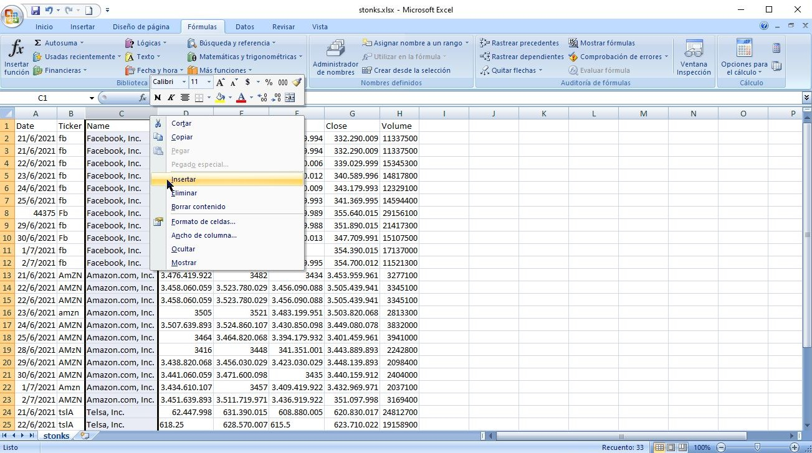
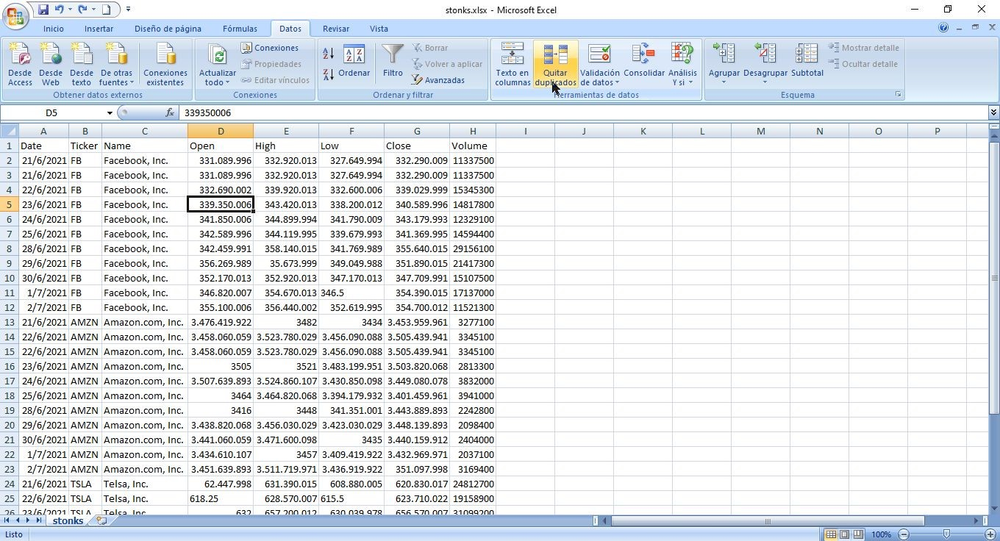
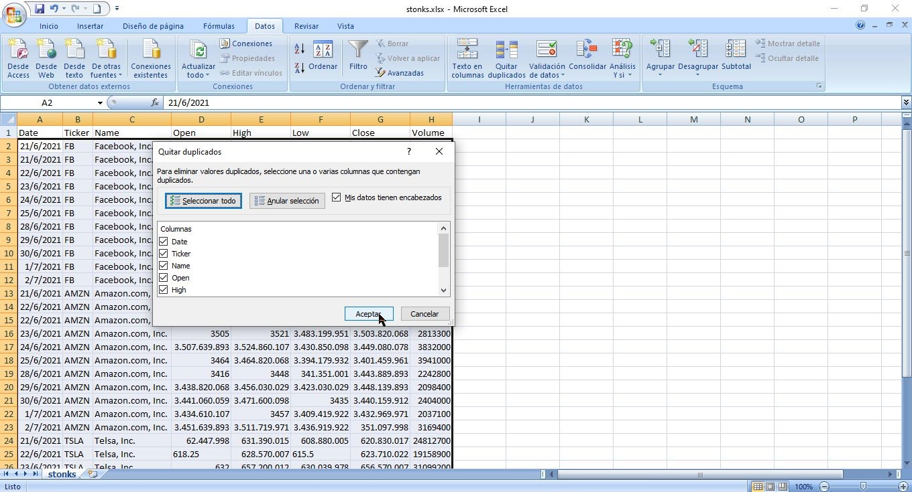

<h1 align="center">Limpieza de Datos en Excel</h1>

   
  

 

## Tareas:
---

- [Separar archivo csv delimitado por comas en columnas](#separar-archivo-csv-delimitado-por-comas-en-columnas)
- [Ajustar tamaño de columnas](#ajustar-tamaño-de-columnas)
- [Eliminar filas en blanco](#eliminar-filas-en-blanco)
- [Eliminar exceso de espacios](#eliminar-exceso-de-espacios)
- [Reemplazar valores](#reemplazar-valores)
- [Estandarizar texto](#estandarizar-texto)
- [Estandarizar fechas](#estandarizar-fechas)
- [Quitar duplicados](#quitar-duplicados)

 
 

## Separar archivo csv delimitado por comas en columnas
---
 

1. Seleccionar la columna a editar:

2. Seleccionar  **Datos > Texto en Columnas**

3. Seleccionar  **Delimitados > Siguiente**

4. Seleccionar **Coma > Siguiente**

5. Seleccionar **General > Finalizar**

 
 

## Ajustar tamaño de columnas
---
 

1. Seleccionar todas las columnas:

2. Posicionar el cursor entre dos de las columnas seleccionadas hasta ver el cursor con flechas en ambas direcciones y dar "Doble Click"

 
 

## Eliminar filas en blanco
---
 

1. Seleccionar todo haciendo "Click" sobre la union entre las columnas y filas en la esquina superior izquierda

2. Seleccionar **Buscar y Seleccionar > Ir a Especial**

3. Seleccionar **Celdas en Blanco > Aceptar**

4. Con las filas en blanco marcadas, seleccionar **Eliminar**

 
 

## Eliminar exceso de espacios
---
 

Para eliminar los espacios en exceso de la columna "Name" primero hay que crear una columna vacia a la derecha.

1. En este caso hacer "Click" sobre la letra "D" y luego seleccionar **Insertar**

2. Seleccionar el primer campo sin contar el titulo de la columna

3. Con el campo seleccionado, dentro de la pestaña **Formulas** Seleccionar **Texto > ESPACIOS**

4. Dentro del campo **Texto** colocar el nombre de la primer celda de la columna  que contiene los espacios a eliminar, en este caso es la celda **C2** y luego **Aceptar**

5. Con el primer corregido, posicionamos el cursor sobre la parte inferior derecha de la celda y hacemos "Doble Click"

6. Copiar la Columna con los valores corregidos

7. Selecionar la misma columna con los valores corregidos y hacer "Click" con el Boton Derecho y seleccionar **Pegado Especial**

8. Selecionar **Valores > Aceptar**

9. Eliminar la columna que contiene los espacios de mas

10. Agregar el titulo a la columna

 
 

## Reemplazar valores
---
 

1. Seleccionar **Buscar y Seleccionar > Reemplazar**

2. En este caso hay que reemplazar "Telsa" por "Tesla", luego seleccionar **Reemplazar todos > Aceptar**

 
 

## Estandarizar texto
---
 

Similar a eliminar los espacios en exceso, hay que crear una columna vacia a la derecha de la columna con la hay que trabajar

1. En este caso hacer "Click" sobre la columna "D" y luego seleccionar **Insertar**

2. Seleccionar el primer campo sin contar el titulo de la columna

3. Con el campo seleccionado, dentro de la pestaña **Formulas** Seleccionar **Texto > MAYUS**

4. Dentro del campo **Texto** colocar el nombre de la primer celda de la columna  que hay que estandarizar, en este caso es la celda **B2** y luego **Aceptar**

5. Con el nombre de la primer celda corregido, posicionamos el cursor sobre la parte inferior derecha de la celda y hacemos "Doble Click"

6. Copiar la Columna con los valores estandarizados

7. Selecionar la misma columna y con el Boton Derecho seleccionar **Pegado Especial**

8. Selecionar **Valores > Aceptar**

9. Agregar titulo "Ticker" a la columna

10. Eliminar la columna con el nombre de los tickers no estandarizados

 
 

## Estandarizar fechas
---
 

1. Seleccionar la primer columna que es la que contiene las fechas y cambiar **General** por **Fecha corta**

 
 

## Quitar duplicados
---
 

1. Seleccionar una celda que contenga algun dato y dentro de la pestaña **Datos** seleccionar **Quitar duplicados**

2. Seleccionar **Seleccionar todo > Aceptar**

